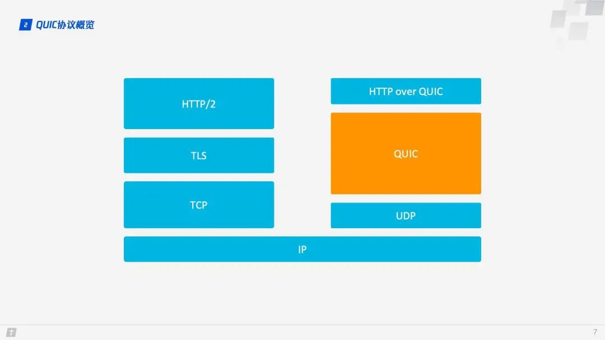
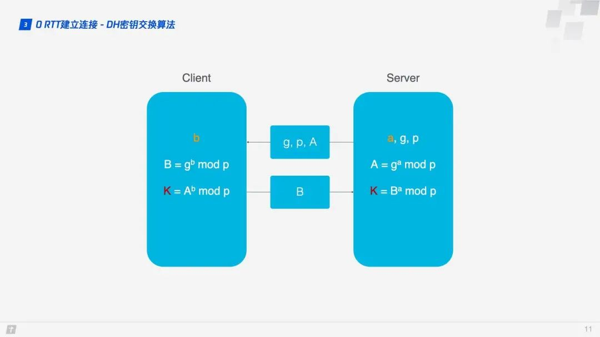
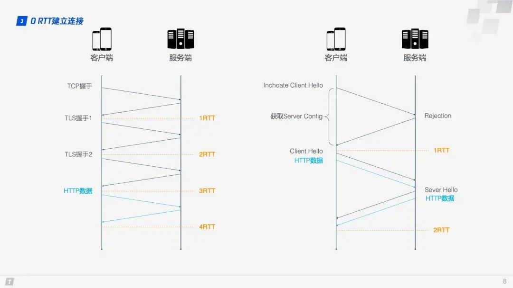

#### http/3
##### 1.1 http发展史
http\0.9(1991)---http\0.9---http\1.0---http\1.1---SPDY---QUIC---http\2.0(2015)---http\3.0(2018)

##### 1.2 QUIC 协议概览
QUIC（Quick UDP Internet Connections，快速 UDP 网络连接） 基于 UDP，正是看中了 UDP 的速度与效率。同时 QUIC 也整合了 TCP、TLS 和 HTTP/2 的优点，并加以优化。用一张图可以清晰地表示他们之间的关系。
那 QUIC 和 HTTP/3 什么关系呢？QUIC 是用来替代 TCP、SSL/TLS 的传输层协议，在传输层之上还有应用层，我们熟知的应用层协议有 HTTP、FTP、IMAP 等，这些协议理论上都可以运行在 QUIC 之上，其中运行在 QUIC 之上的 HTTP 协议被称为 HTTP/3，这就是”HTTP over QUIC 即 HTTP/3“的含义。

##### 1.3 零 RTT 建立连接

用一张图可以形象地看出 HTTP/2 和 HTTP/3 建立连接的差别。

这里使用的是 DH 密钥交换算法，DH 算法的核心就是服务端生成 a、g、p 3 个随机数，a 自己持有，g 和 p 要传输给客户端，而客户端会生成 b 这 1 个随机数，通过 DH 算法客户端和服务端可以算出同样的密钥。在这过程中 a 和 b 并不参与网络传输，安全性大大提高。因为 p 和 g 是大数，所以即使在网络中传输的 p、g、A、B 都被劫持，那么靠现在的计算机算力也没法破解密钥。

Step1：首次连接时，客户端发送 Inchoate Client Hello 给服务端，用于请求连接；
Step2：服务端生成 g、p、a，根据 g、p 和 a 算出 A，然后将 g、p、A 放到 Server Config 中再发送 Rejection 消息给客户端；
Step3：客户端接收到 g、p、A 后，自己再生成 b，根据 g、p、b 算出 B，根据 A、p、b 算出初始密钥 K。B 和 K 算好后，客户端会用 K 加密 HTTP 数据，连同 B 一起发送给服务端；
Step4：服务端接收到 B 后，根据 a、p、B 生成与客户端同样的密钥，再用这密钥解密收到的 HTTP 数据。为了进一步的安全（前向安全性），服务端会更新自己的随机数 a 和公钥，再生成新的密钥 S，然后把公钥通过 Server Hello 发送给客户端。连同 Server Hello 消息，还有 HTTP 返回数据；
Step5：客户端收到 Server Hello 后，生成与服务端一致的新密钥 S，后面的传输都使用 S 加密。
这样，QUIC 从请求连接到正式接发 HTTP 数据一共花了 1 RTT，这 1 个 RTT 主要是为了获取 Server Config，后面的连接如果客户端缓存了 Server Config，那么就可以直接发送 HTTP 数据，实现 0 RTT 建立连接。
##### 1.4 连接迁移

TCP 连接基于四元组（源 IP、源端口、目的 IP、目的端口），切换网络时至少会有一个因素发生变化，导致连接发生变化。当连接发生变化时，如果还使用原来的 TCP 连接，则会导致连接失败，就得等原来的连接超时后重新建立连接，所以我们有时候发现切换到一个新网络时，即使新网络状况良好，但内容还是需要加载很久。如果实现得好，当检测到网络变化时立刻建立新的 TCP 连接，即使这样，建立新的连接还是需要几百毫秒的时间。
QUIC 的连接不受四元组的影响，当这四个元素发生变化时，原连接依然维持。那这是怎么做到的呢？道理很简单，QUIC 连接不以四元组作为标识，而是使用一个 64 位的随机数，这个随机数被称为 Connection ID，即使 IP 或者端口发生变化，只要 Connection ID 没有变化，那么连接依然可以维持。
##### 1.5 队头阻塞/多路复用

HTTP/1.1 和 HTTP/2 都存在队头阻塞问题（Head of line blocking）

HTTP/1.1 的队头阻塞。一个 TCP 连接同时传输 10 个请求，其中第 1、2、3 个请求已被客户端接收，但第 4 个请丢失，那么后面第 5 - 10 个请求都被阻塞，需要等第 4 个请求处理完毕才能被处理，这样就浪费了带宽资源。

HTTP/2 的多路复用解决了上述的队头阻塞问题。不像 HTTP/1.1 中只有上一个请求的所有数据包被传输完毕下一个请求数据包才可以被传输，HTTP/2 中每个请求都被拆分成多个 Frame 通过一条 TCP 连接同时被传输，这样即使一个请求阻塞，也不会影响其他的请求。如下图所示，不同颜色代表不同的请求，相同颜色的色块代表请求被切分的 Frame。HTTP/2 的每个请求都会被拆分成多个 Frame，不同请求的 Frame 组合成 Stream，Stream 是 TCP 上的逻辑传输单元，这样 HTTP/2 就达到了一条连接同时发送多条请求的目标，这就是多路复用的原理。

HTTP/2 的问题在于在一条 TCP 连接上同时发送 4 个 Stream，其中 Stream1 已正确送达，Stream2 中的第 3 个 Frame 丢失，TCP 处理数据时有严格的前后顺序，先发送的 Frame 要先被处理，这样就会要求发送方重新发送第 3 个 Frame，Stream3 和 Stream4 虽然已到达但却不能被处理，那么这时整条连接都被阻塞。不仅如此，由于 HTTP/2 必须使用 HTTPS，而 HTTPS 使用的 TLS 协议也存在队头阻塞问题。TLS 基于 Record 组织数据，将一堆数据放在一起（即一个 Record）加密，加密完后又拆分成多个 TCP 包传输。一般每个 Record 16K，包含 12 个 TCP 包，这样如果 12 个 TCP 包中有任何一个包丢失，那么整个 Record 都无法解密。

QUIC 的对头阻塞的原理：

QUIC 的传输单元是 Packet，加密单元也是 Packet，整个加密、传输、解密都基于 Packet，这样就能避免 TLS 的队头阻塞问题；
QUIC 基于 UDP，UDP 的数据包在接收端没有处理顺序，即使中间丢失一个包，也不会阻塞整条连接，其他的资源会被正常处理。
###### 1.6 拥塞控制
 
TCP 拥塞控制由 4 个核心算法组成：慢启动、拥塞避免、快速重传和快速恢复
QUIC  重新实现了 TCP 协议的 Cubic 算法进行拥塞控制
- 1. 热插波：  QUIC 修改拥塞控制策略只需要在应用层操作，并且 QUIC 会根据不同的网络环境、用户来动态选择拥塞控制算法
- 2. 前向纠错 FEC：  增加了协议的容错性
- 3. 单调递增的 Packet Number：   TCP 为了保证可靠性，使用 Sequence Number 和 ACK 来确认消息是否有序到达，超时发生后客户端发起重传，后来接收到了 ACK 确认消息，但因为原始请求和重传请求接收到的 ACK 消息一样，所以客户端就郁闷了，不知道这个 ACK 对应的是原始请求还是重传请求。QUIC 解决了上面的歧义问题。与 Sequence Number 不同的是，Packet Number 严格单调递增，如果 Packet N 丢失了，那么重传时 Packet 的标识不会是 N，而是比 N 大的数字，比如 N + M，这样发送方接收到确认消息时就能方便地知道 ACK 对应的是原始请求还是重传请求。
- 4. ACK Delay :没有考虑接收方接收到数据到发送确认消息之间的延迟,这段延迟即 ACK Delay。QUIC 考虑了这段延迟，使得 RTT 的计算更加准确
- 5. 更多的 ACK 块: TCP SACK 最多提供 3 个 ACK block。但有些场景下，比如下载，只需要服务器返回数据就好，但按照 TCP 的设计，每收到 3 个数据包就要“礼貌性”地返回一个 ACK。而 QUIC 最多可以捎带 256 个 ACK block。在丢包率比较严重的网络下，更多的 ACK block 可以减少重传量，提升网络效率。
###### 1.7 流量控制
TCP 的流量控制主要通过滑动窗口来实现的。可以看出，拥塞控制主要是控制发送方的发送策略，但没有考虑到接收方的接收能力，流量控制是对这部分能力的补齐。
QUIC 的流量控制有两个级别: 连接级别（Connection Level）和 Stream 级别（Stream Level）
- 单条 Stream 的流量控制: Stream 还没传输数据时，接收窗口（flow control receive window）就是最大接收窗口（flow control receive window），随着接收方接收到数据后，接收窗口不断缩小。随着数据不断被处理，接收方就有能力处理更多数据。当满足 (flow control receive offset - consumed bytes) < (max receive window / 2) 时，接收方会发送 WINDOW_UPDATE frame 告诉发送方你可以再多发送些数据过来。这时 flow control receive offset 就会偏移，接收窗口增大，发送方可以发送更多数据到接收方。
Stream 级别对防止接收端接收过多数据作用有限，更需要借助 Connection 级别的流量控制。理解了 Stream 流量那么也很好理解 Connection 流控。Stream 中，接收窗口(flow control receive window) = 最大接收窗口(max receive window) - 已接收数据(highest received byte offset) ，而对 Connection 来说：接收窗口 = Stream1 接收窗口 + Stream2 接收窗口 + ... + StreamN 接收窗口 。

#### 总结

HTTP1/1（高延迟、对头阻塞、无状态、明文传输、不支持服务器推送）
SPDY 协议与 HTTP/2 （二进制传输、Header压缩、多路复用、服务端推送、提高安全性https）
HTTP/2 (TCP 以及 TCP+TLS建立连接的延时、对头阻塞)
HTPP/3 (快速握手、零RTT、类似TCP的流量控制、传输可靠性的功能、集成了TLS加密功能、多路复用-彻底解决队头阻塞)
