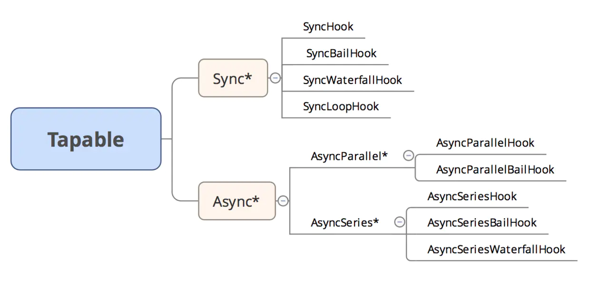

#### webpack发展史
学习时间：8.1-8.30
##### 什么是 webpack？

>webpack是一个打包工具，他的宗旨是一切静态资源皆可打包。作为前端开发人员，我们应该熟悉 module 概念。 你可能听说过 AMD模块，UMD，Common JS还有ES模块。
webpack是一个模块绑定器，它对模块有一个更广泛的定义，对于webpack来说，模块是：

- Common JS modules
- AMD modules
- CSS import
- Images url
- ES modules

>webpack 还可以从这些模块中获取依赖关系。
webpack 的最终目标是将所有这些不同的源和模块类型统一起来，从而将所有内容导入JavaScript代码，并最生成可以运行的代码。

##### webpack核心概念

```javascript
const path = require('path');
module.exports = {
  entry: "./app/entry", // string | object | array  // Webpack打包的入口
  output: {  // 定义webpack如何输出的选项
    path: path.resolve(__dirname, "dist"), // string // 所有输出文件的目标路径
    filename: "[chunkhash].js", // string   // 「入口(entry chunk)」文件命名模版
    publicPath: "/assets/", // string// 构建文件的输出目录
    /* 其它高级配置 */
  },
  module: {  // 模块相关配置
    rules: [ // 配置模块loaders，解析规则
      {
        test: /\.jsx?$/,  // RegExp | string
        include: [ // 和test一样，必须匹配选项
          path.resolve(__dirname, "app")
        ],
        exclude: [ // 必不匹配选项（优先级高于test和include）
          path.resolve(__dirname, "app/demo-files")
        ],
        loader: "babel-loader", // 模块上下文解析
        options: { // loader的可选项
          presets: ["es2015"]
        },
      },
  },
  resolve: { //  解析模块的可选项
    modules: [ // 模块的查找目录
      "node_modules",
      path.resolve(__dirname, "app")
    ],
    extensions: [".js", ".json", ".jsx", ".css"], // 用到的文件的扩展
    alias: { // 模块别名列表
      "module": "new-module"
	  },
  },
  devtool: "source-map", // enum   // 为浏览器开发者工具添加元数据增强调试
  plugins: [ // 附加插件列表
    // ...
  ],
}
```
从上面我们可以看到，webpack配置中需要理解几个核心的概念Entry 、Output、Loaders 、Plugins、 Chunk
1. Entry(入口)：指示 webpack 应该使用哪个模块，来作为构建其内部依赖图的开始。进入入口起点后，webpack 会找出有哪些模块和库是入口起点（直接和间接）依赖的。其默认入口点（从版本4开始）是src/index.js，它是可配置的。 webpack 可以有多个入口点
2. Output(出口)：告诉webpack如何命名输出的文件以及输出的目录，是生成的Javascript和静态文件的地方。默认值为./dist。
3. Loader（模块转换器）：对一些非js文件处理成webpack能够处理的模块，比如sass文件转换为 webpack 能够处理的有效模块，然后你就可以利用 webpack 的打包能力，对它们进行处理。
4. Plugins（插件）：Loaders将各类型的文件处理成webpack能够处理的模块，plugins有着很强的能力。插件的范围包括，从打包优化和压缩，一直到重新定义环境中的变量。但也是最复杂的一个。比如对js文件进行压缩优化的UglifyJsPlugin插件.
5. Chuck:coding split的产物，我们可以对一些代码打包成一个单独的chunk，比如某些公共模块，去重，更好的利用缓存。或者按需加载某些功能模块，优化加载时间。在webpack3及以前我们都利用CommonsChunkPlugin将一些公共代码分割成一个chunk，实现单独加载。在webpack4 中CommonsChunkPlugin被废弃，使用SplitChunksPlugin.

6. Module(模块)：开发者将程序分解成离散功能块，并称之为模块

7. Mode(模式)：通过选择 development 或 production 之中的一个，来设置 mode 参数，你可以启用相应模式下的 webpack 内置的优
##### webpack详解

###### Tapable

> webpack本质上是一种事件流的机制，它的工作流程就是将各个插件串联起来，而实现这一切的核心就是Tapable，webpack中最核心的负责编译的Compiler和负责创建bundles的Compilation都是Tapable的实例。在Tapable1.0之前，也就是webpack3及其以前使用的Tapable，提供了包括
 - plugin(name:string, handler:function)注册插件到Tapable对象中
 - apply(…pluginInstances: (AnyPlugin|function)[])调用插件的定义，将事件监听器注册到Tapable实例注册表中
 - applyPlugins*(name:string, …)多种策略细致地控制事件的触发，包括applyPluginsAsync、applyPluginsParallel等方法实现对事件触发的控制，实现
（1）多个事件连续顺序执行
（2）并行执行
（3）异步执行
（4）一个接一个地执行插件，前面的输出是后一个插件的输入的瀑布流执行顺序
（5）在允许时停止执行插件，即某个插件返回了一个undefined的值，即退出执行
我们可以看到，Tapable就像nodejs中EventEmitter,提供对事件的注册on和触发emit.

>当然上面提到的Tapable都是1.0版本之前的，如果想深入学习，可以查看Tapable 和 事件流
那1.0的Tapable又是什么样的呢？1.0版本发生了巨大的改变，不再是此前的通过plugin注册事件，通过applyPlugins*触发事件调用，那1.0的Tapable是什么呢？
- 暴露出很多的钩子，可以使用它们为插件创建钩子函数
其用法是：插件注册数量、插件注册的类型（sync, async, promise）、调用的方式（sync, async, promise）、实例钩子的时候参数数量、是否使用了interception
举个例子：
```javascript
const {   //创建钩子函数
	SyncHook,     //同步串行，不关心监听函数的返回值
	SyncBailHook, //同步串行，只要监听函数中有一个函数的返回值不为null则跳过剩下所有的逻辑
	SyncWaterfallHook,//同步串行，上一个监听函数的返回值可以传给下一个监听函数
	SyncLoopHook,     //同步循环， 监听函数被触发，如果该监听函数返回true则反复执行，返回undefined则表示退出循环
	AsyncParallelHook, //异步并发，不关心监听函数的返回值
	AsyncParallelBailHook,//异步并发，只要监听函数的返回值不为null,忽略后续函数的执行，直接跳跃到callAsync等触发函数绑定的回调，执行回调函数
	AsyncSeriesHook,//异步串行，不关心callback()的参数
	AsyncSeriesBailHook,//异步串行，callback()的参数不为null,直接执行callAsync等触发函数绑定的回调函数
	AsyncSeriesWaterfallHook //上一个监听函数的中的callback(err, data)的第二个参数,可以作为下一个监听函数的参数
 } = require("tapable");
 //用法
class Order {
    constructor() {
        this.hooks = { //hooks
            goods: new SyncHook(['goodsId', 'number']),
            consumer: new AsyncParallelHook(['userId', 'orderId'])
        }
    }

    queryGoods(goodsId, number) {
        this.hooks.goods.call(goodsId, number);
    }

    consumerInfoPromise(userId, orderId) {
        this.hooks.consumer.promise(userId, orderId).then(() => {
            //TODO
        })
    }

    consumerInfoAsync(userId, orderId) {
        this.hooks.consumer.callAsync(userId, orderId, (err, data) => {
            //TODO
        })
    }
}
const hook = new SyncHook(["arg1", "arg2", "arg3"]);
// 调用tap方法注册一个consument
order.hooks.goods.tap('QueryPlugin', (goodsId, number) => {
    return fetchGoods(goodsId, number);
})
// 再添加一个
order.hooks.goods.tap('LoggerPlugin', (goodsId, number) => {
    logger(goodsId, number);
})

// 调用
order.queryGoods('10000000', 1)
对于一个 SyncHook,我们通过tap来添加消费者，通过call来触发钩子的顺序执行。
对于一个非sync*类型的钩子，即async*类型的钩子，我们还可以通过其它方式注册消费者和调用：
// 注册一个sync 钩子
order.hooks.consumer.tap('LoggerPlugin', (userId, orderId) => {
   logger(userId, orderId);
})
order.hooks.consumer.tapAsync('LoginCheckPlugin', (userId, orderId, callback) => {
    LoginCheck(userId, callback);
})
order.hooks.consumer.tapPromise('PayPlugin', (userId, orderId) => {
    return Promise.resolve();
})
// 调用  // 返回Promise
order.consumerInfoPromise('user007', '1024');
//回调函数
order.consumerInfoAsync('user007', '1024')

```
###### Tapable详解

对于Sync*类型的钩子来说。
- 注册在该钩子下面的插件的执行顺序都是顺序执行。
- 只能使用tap注册，不能使用tapPromise和tapAsync注册
```javascript
// 所有的钩子都继承于Hook
class Sync* extends Hook { 
	tapAsync() { // Sync*类型的钩子不支持tapAsync
		throw new Error("tapAsync is not supported on a Sync*");
	}
	tapPromise() {// Sync*类型的钩子不支持tapPromise
		throw new Error("tapPromise is not supported on a Sync*");
	}
	compile(options) { // 编译代码来按照一定的策略执行Plugin
		factory.setup(this, options);
		return factory.create(options);
	}
}

```
对于Async*类型钩子

- 支持tap、tapPromise、tapAsync注册
```javascript
// 所有的钩子都继承于Hook
class AsyncParallelHook extends Hook {
	constructor(args) {
		super(args);
		this.call = this._call = undefined;
	}
	compile(options) {
		factory.setup(this, options);
		return factory.create(options);
	}
}

```
```javascript
// Hook
class Hook {
	constructor(args) {
		if(!Array.isArray(args)) args = [];
		this._args = args; // 实例钩子的时候的string类型的数组
		this.taps = []; // 消费者
		this.interceptors = []; // interceptors
		this.call = this._call =  // 以sync类型方式来调用钩子
		this._createCompileDelegate("call", "sync");
		this._promise = // 以promise方式
		this._createCompileDelegate("promise", "promise");
		this._callAsync = // 以async类型方式来调用
		this._createCompileDelegate("callAsync", "async");
		this._x = undefined; // 
	}

	_createCall(type) {
		return this.compile({
			taps: this.taps,
			interceptors: this.interceptors,
			args: this._args,
			type: type
		});
	}

	_createCompileDelegate(name, type) {
		const lazyCompileHook = (...args) => {
			this[name] = this._createCall(type);
			return this[name](...args);
		};
		return lazyCompileHook;
	}
	// 调用tap 类型注册
	tap(options, fn) {
		// ...
		options = Object.assign({ type: "sync", fn: fn }, options);
		// ...
		this._insert(options);  // 添加到 this.taps中
	}
	// 注册 async类型的钩子
	tapAsync(options, fn) {
		// ...
		options = Object.assign({ type: "async", fn: fn }, options);
		// ...
		this._insert(options); // 添加到 this.taps中
	}
	//注册 promise类型钩子
	tapPromise(options, fn) {
		// ...
		options = Object.assign({ type: "promise", fn: fn }, options);
		// ...
		this._insert(options); // 添加到 this.taps中
	}
	
}
```
每次都是调用tap、tapSync、tapPromise注册不同类型的插件钩子，通过调用call、callAsync 、promise方式调用。其实调用的时候为了按照一定的执行策略执行，调用compile方法快速编译出一个方法来执行这些插件。